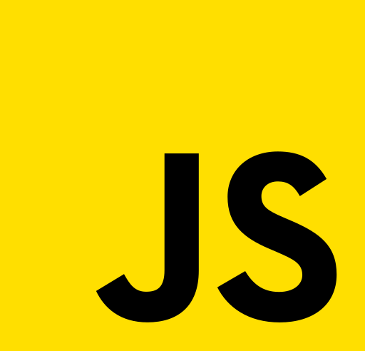
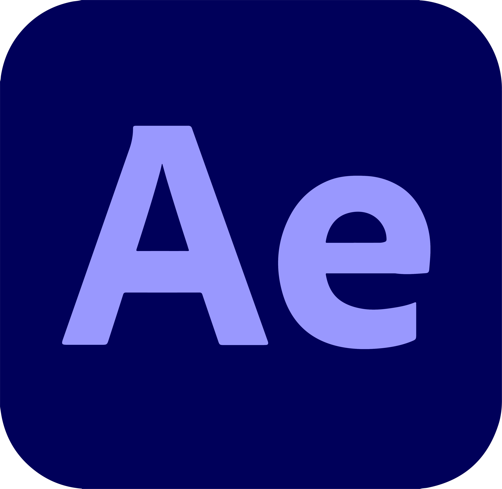

<h1> Hey, I'm Tushar Khatri! </h1>

<h2> Glad to see you here! </h2>

I am a Full Stack Web Developer, always up for learning and growing. I like to make things that make a difference.

<h3> Talking about personal stuff: </h3>

- 💻 Currently working on Node.js.
- 📖 Currently learning React.js, Data Structures and Algorithm.
- 💬 Ask me about anything, I am here to help.
- ⚡ Fun fact: When I am not working you can find me playing VALORANT!

<h3> Languages and Tools: </h3>

 
 
 
 
 
 

 
 
 

 

<h3> Connect with me: </h3>

